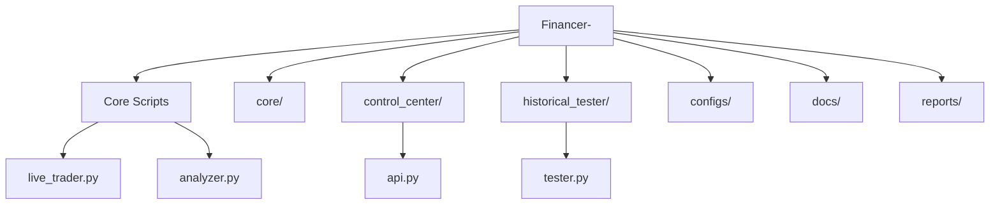

# Financer

Financer is a Python trading and analysis repository with three operational surfaces:

- **fundamental equity analysis and report generation**
- **live strategy loop** with risk controls and operator controls
- **historical replay lab** for fast strategy validation

## Start Here

Read in this order:

1. `docs/START_HERE.md`
2. `docs/ARCHITECTURE.md`
3. `docs/FEATURES_AND_FUNCTIONS.md`
4. `docs/API_CONTROL_CENTER.md`
5. `docs/OPERATIONS_RUNBOOK.md`

## Setup

Use Python 3.12+ in a virtual environment, then install core dependencies:

```bash
python -m pip install yfinance pandas numpy plotly beautifulsoup4 lxml peewee textblob pyyaml
```

Optional test dependency:

```bash
python -m pip install pytest
```

## Documentation Entry Points

- `docs/START_HERE.md` - setup and first execution steps
- `docs/FEATURES_AND_FUNCTIONS.md` - complete functional breakdown
- `docs/ARCHITECTURE.md` - component and flow diagrams
- `docs/CONFIG_SCHEMA.md` - runtime config keys and override behavior
- `docs/RISK_ENGINE_V2.md` - portfolio-level risk gate behavior
- `docs/EXECUTION_ENGINE.md` - execution model and fill simulation behavior
- `docs/HISTORICAL_LAB.md` - replay/sweep/walk-forward/compare behavior
- `docs/ENGINE_INTERFACE.md` - engine adapter contracts (`native`, `backtrader`)
- `docs/BENCHMARK_REPORT.md` - standardized benchmark output format
- `docs/OPTIMIZER_GUIDE.md` - objective-driven optimizer contract
- `docs/LEAN_VALIDATION.md` - LEAN parity validation adapter
- `docs/API_CONTROL_CENTER.md` - control API endpoints
- `docs/EXPLAINABILITY.md` - decision log structure and usage
- `docs/ALERTS_AND_APPROVALS.md` - alerts and manual approval workflow
- `docs/OPERATIONS_RUNBOOK.md` - practical runtime operating guide

## Common Commands

Run from `Financer-/`:

```bash
# Fundamental analysis
python downloader.py "Palo Alto Networks"
python analyzer.py

# Live bot
python live_trader.py --status
python live_trader.py --loop --profile balanced

# Historical replay
python -m historical_tester
python -m historical_tester --mode single --engine native
python -m historical_tester --mode single --engine backtrader
python -m historical_tester --mode benchmark --engines native,backtrader
python -m historical_tester --mode benchmark --engines native,backtrader --validate-with lean
python -m historical_tester --mode sweep --engine native
```

## Typical Workflows

- **Fundamental analysis workflow**
  - run `downloader.py` to collect company filings
  - run `analyzer.py` to generate valuation/report output
  - review reports in `reports/`

- **Live bot workflow**
  - check current state with `--status`
  - run loop with a profile (`--profile balanced`)
  - apply targeted overrides with `--set key=value`
  - optionally run Control API to operate runtime safely

- **Historical validation workflow**
  - run `python -m historical_tester`
  - choose mode (`single`, `benchmark`, `sweep`, `interactive`)
  - choose engine (`native` or `backtrader`) for mode-compatible flows
  - optional parity check with `--validate-with lean` in benchmark mode
  - inspect output artifacts in `test_results/`

## Smoke Test Checklist

Run from `Financer-/`:

```bash
python -m compileall historical_tester tests
python -m historical_tester --help
python -m historical_tester --mode benchmark --engines native,backtrader --validate-with lean --start-date 2024-01-01 --end-date 2024-01-15
```

If you want contract tests:

```bash
python -m pytest -q tests/test_engine_contract.py tests/test_backtrader_engine_smoke.py tests/test_optimizer_contract.py tests/test_lean_adapter_contract.py
```

## Functional Areas

- `analyzer.py`, `downloader.py`, `technical.py`: filing ingestion + valuation report pipeline
- `live_trader.py`, `portfolio.py`, `indicators.py`: live strategy execution
- `historical_tester/`: historical simulation, sweeps, walk-forward, A/B compare
- `control_center/`: runtime control state + local operator API
- `core/`: reusable services (`strategy`, `risk`, `execution`, `explainability`, `alerts`)
- `configs/`: default strategy config and risk profiles
- `docs/`: operational and architecture documentation

## Key Runtime Artifacts

The following files/folders are expected to be produced/updated during operation:

- `wallet.json` and `equity_curve.json` - portfolio state and equity history
- `docs/dashboard.html` - live dashboard output (static snapshot; regenerated by `legacy/live_trader.py`)
- `reports/` - generated analysis reports and downloaded SEC artifacts
- `test_results/` - historical tester reports and run outputs
- `logs/decisions/*.jsonl` - structured decision/audit events
- `logs/alerts/alerts.jsonl` - alert output log

## Operator Controls

- Start Control API:

```bash
python live_trader.py --control-api
```

- Control state file:
  - `control_center/state.json`
- Decision logs:
  - `logs/decisions/*.jsonl`
- Alert logs:
  - `logs/alerts/alerts.jsonl`

## Visual Map


