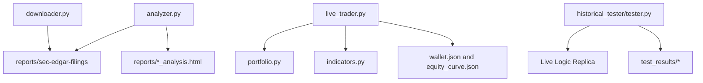

# Financer Repository

Financer contains three primary workflows:

- `fundamental analysis`: download SEC filings and generate valuation reports
- `live trading bot`: run swing-trading cycles with risk controls
- `historical tester`: replay the live bot on historical data in accelerated mode for fast validation of changes

## Quick Start

From `Financer-`:

```bash
python downloader.py "Palo Alto Networks"
python analyzer.py
python live_trader.py --status
python -m historical_tester.tester
python live_trader.py --profile balanced --set risk.max_positions_per_sector=4 --status
```

## Repository Structure

- Core strategy/runtime:
  - `analyzer.py`, `downloader.py`, `technical.py`
  - `live_trader.py`, `portfolio.py`, `indicators.py`, `data_static.py`
- Historical replay:
  - `historical_tester/`
- Documentation:
  - `docs/` (`analyzer.md`, `v3_plan.md`, `ARCHITECTURE.md`, `ROADMAP_1_7.md`, `CONFIG_SCHEMA.md`, `EXECUTION_ENGINE.md`, `HISTORICAL_LAB.md`, `API_CONTROL_CENTER.md`, `EXPLAINABILITY.md`, `ALERTS_AND_APPROVALS.md`, `OPERATIONS_RUNBOOK.md`)
  - `configs/` (`strategy/default.yaml`, `profiles/*.yaml`)
  - `CLAUDE.md`, `README.md`
- Outputs/runtime artifacts:
  - `reports/`, `dashboard.html`, `wallet.json`, `equity_curve.json`
- Supporting folders:
  - `tests/`, `tools/`

## Historical Tester

The tester is intentionally isolated under `historical_tester/` so other developers can validate strategy changes without running live loops.

- entrypoint: `python -m historical_tester.tester`
- outputs: HTML, JSON, and CSV reports under `test_results/`
- uses separate wallet path (default `test_wallet.json`) to avoid touching live wallet files

See `historical_tester/README.md` for usage and details.

## Sprint 1 Controls (Config + Risk Engine v2)

- Runtime config:
  - `--config <path>` load custom YAML
  - `--profile <name>` apply profile overlay (`conservative`, `balanced`, `aggressive`)
  - `--set key=value` override any dotted config key
- Risk Engine v2 gates new entries by:
  - daily realized-loss halt
  - open-risk budget cap
  - sector concentration cap
  - estimated per-trade risk cap

## Sprint 3 Controls and Explainability

- Run Control API: `python live_trader.py --control-api`
- Cycle control flags in `control_center/state.json`:
  - `running`, `pause_buys`, `pause_sells`, `emergency_flatten`
- Decision logs written to:
  - `logs/decisions/*.jsonl`

## Sprint 4 Alerts and Approval

- Alerts:
  - `core/alerts/notifier.py` (console/file/webhook channels)
  - `core/alerts/rules.py` (event filtering)
- Manual approval:
  - set `approval_mode=manual` in control state
  - inspect queue via `GET /approvals`
  - approve/reject via `POST /approvals/decision`

## Architecture Diagram



## Cleanup Notes (Completed)

- Historical testing code has been consolidated under `historical_tester/`
- Documentation files were moved into `docs/`
- Validation and helper scripts were grouped under `tests/` and `tools/`
