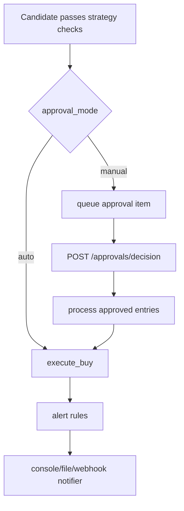

# Alerts and Approval Workflow

- alerting adapters (console/file/webhook)
- rule-based alert triggers
- manual approval workflow for entries
- emergency flatten alerts

## Modules

- `core/alerts/notifier.py`
- `core/alerts/rules.py`
- `control_center/approvals.py`

## Manual Approval Flow

1. Set `approval_mode` to `manual` in `control_center/state.json`
2. Bot queues candidate entries instead of executing buys
3. Approve/reject via Control API:
   - `GET /approvals`
   - `POST /approvals/decision` with `{ "id": "...", "decision": "approve" }`
4. Next cycle executes approved entries if still valid

## Alert Triggers

- drawdown circuit breaker
- risk halt messages
- emergency flatten events

## Diagram

