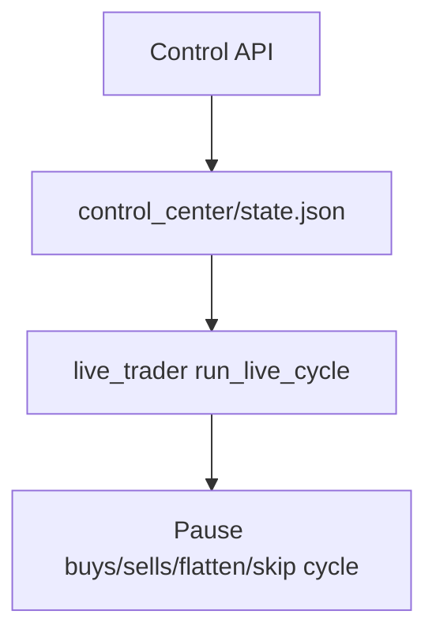

# Control Center API

Local API to control runtime behavior without editing code.

Run:

```bash
python live_trader.py --control-api
```

Default address: `http://127.0.0.1:8765`

## Endpoints

- `GET /status` - service health
- `GET /controls` - current control state
- `POST /controls` - patch control state
- `GET /approvals` - list pending/handled approvals
- `POST /approvals/decision` - approve/reject queued candidate

Example patch:

```json
{
  "pause_buys": true,
  "notes": "Pause entries during CPI release"
}
```

## Runtime Controls

- `running` - skip cycle execution when false
- `pause_buys` - disable new entries
- `pause_sells` - disable exit checks
- `emergency_flatten` - close all non-baseline positions on next cycle
- `approval_mode` - `auto` or `manual`

## Flow


