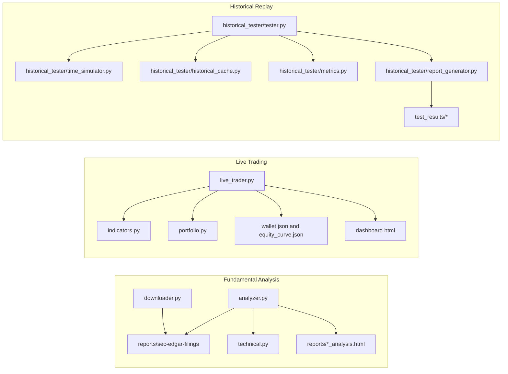
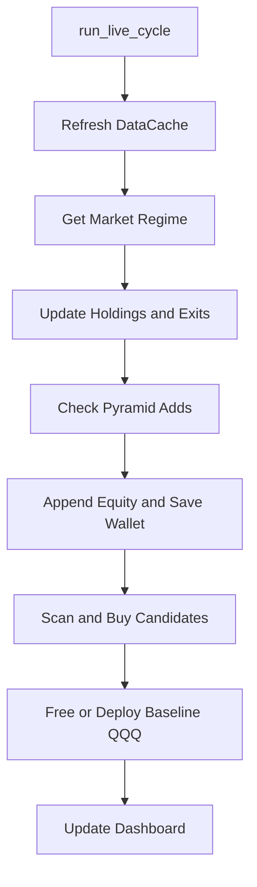
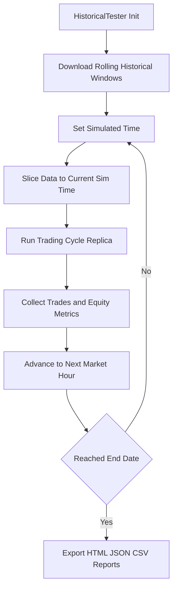

# Financer Architecture

This document gives a visual overview of system components and execution paths.

## High-Level Components

```mermaid
flowchart LR
    subgraph analysis [Fundamental Analysis]
        downloader[downloader.py]
        analyzer[analyzer.py]
        technical[technical.py]
        filings[reports/sec-edgar-filings]
        htmlReports[reports/*_analysis.html]
        downloader --> filings
        analyzer --> filings
        analyzer --> technical
        analyzer --> htmlReports
    end

    subgraph trading [Live Trading]
        liveTrader[live_trader.py]
        indicators[indicators.py]
        portfolio[portfolio.py]
        runtimeFiles[wallet.json and equity_curve.json]
        dashboard[dashboard.html]
        liveTrader --> indicators
        liveTrader --> portfolio
        liveTrader --> runtimeFiles
        liveTrader --> dashboard
    end

    subgraph replay [Historical Replay]
        tester[historical_tester/tester.py]
        timeSimulator[historical_tester/time_simulator.py]
        historicalCache[historical_tester/historical_cache.py]
        metricsCollector[historical_tester/metrics.py]
        reportGenerator[historical_tester/report_generator.py]
        testResults[test_results/*]
        tester --> timeSimulator
        tester --> historicalCache
        tester --> metricsCollector
        tester --> reportGenerator
        reportGenerator --> testResults
    end
```

## Live Trading Cycle

```mermaid
flowchart TD
    startCycle[run_live_cycle] --> refreshCache[Refresh DataCache]
    refreshCache --> regimeCheck[Get Market Regime]
    regimeCheck --> updateHoldings[Update Holdings and Exits]
    updateHoldings --> checkPyramids[Check Pyramid Adds]
    checkPyramids --> recordEquity[Append Equity and Save Wallet]
    recordEquity --> scanBuy[Scan and Buy Candidates]
    scanBuy --> baselineOps[Free or Deploy Baseline QQQ]
    baselineOps --> dashboardUpdate[Update Dashboard]
```

## Historical Replay Cycle

```mermaid
flowchart TD
    initReplay[HistoricalTester Init] --> loadHistoricalData[Download Rolling Historical Windows]
    loadHistoricalData --> setSimTime[Set Simulated Time]
    setSimTime --> sliceCache[Slice Data to Current Sim Time]
    sliceCache --> runCycle[Run Trading Cycle Replica]
    runCycle --> collectMetrics[Collect Trades and Equity Metrics]
    collectMetrics --> advanceTime[Advance to Next Market Hour]
    advanceTime --> doneCheck{Reached End Date}
    doneCheck -->|No| setSimTime
    doneCheck -->|Yes| exportReports[Export HTML JSON CSV Reports]
```
