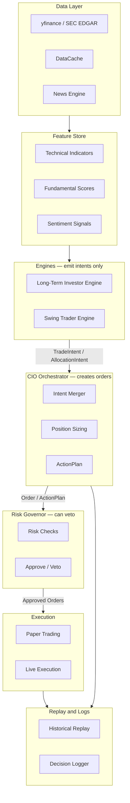
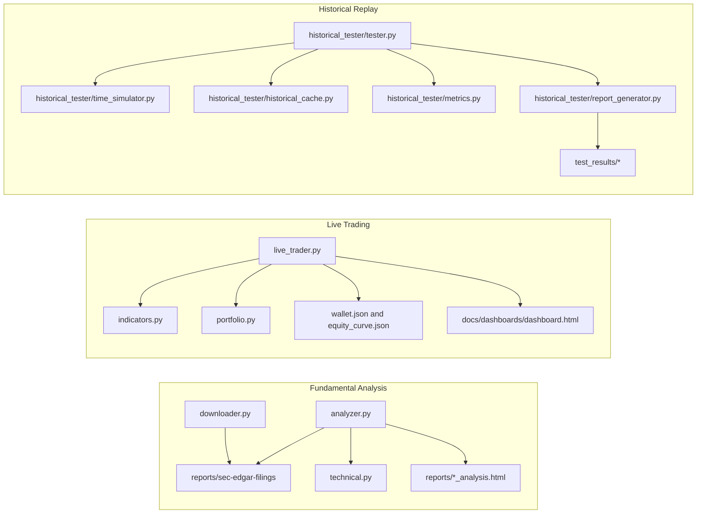
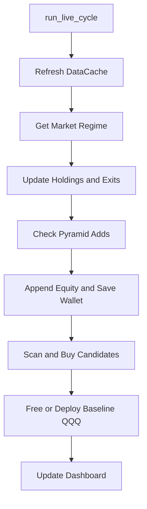
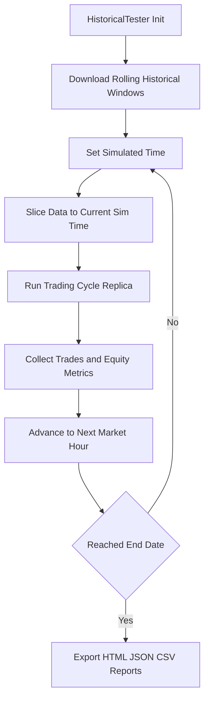

# Financer Architecture

This document gives a visual overview of system components and execution paths.

## Financer Brain — Target Architecture

The platform is being refactored into a layered "Brain" with two engines,
a CIO Orchestrator, and a Risk Governor. Engines emit intents, not orders.

### Core schemas (`financer/models/`)

| Model | Module | Purpose |
|-------|--------|---------|
| `TradeIntent` | `intents.py` | Engine recommendation (ticker, direction, conviction, reasons) |

### Intelligence schemas (`financer/intelligence/`)

| Model | Module | Purpose |
|-------|--------|---------|
| `ControlPlan` | `models.py` | Top-level object containing environmental state and resulting policy constraints. |
| `MarketState` | `models.py` | Nested sub-model tracking Regime and NLP scores. |
| `PolicyOverrides` | `models.py` | Nested sub-model dictating Execution boundaries (e.g. `max_positions`). |

**Intelligence Rules (Non-negotiable)**
- **Controls Risk, Not Alpha:** The intelligence layer may throttle capital deployed (via scaling or lowering positions to 0), but does not execute new isolated positions.
- **Data Only:** `ControlPlan` is read-only. It mutates absolutely nothing.
- **Placeholder Nullification:** Future intelligence variables (e.g., NLP Event Risk, Sentiment Scoring) must remain strictly `Optional[None]` typed until actively wired into the orchestrator. Downstream interfaces must safely parse empty values.
| `AllocationIntent` | `intents.py` | Engine desired portfolio split |
| `ReasonCode` | `intents.py` | Explainable reason attached to any intent |
| `Order` | `actions.py` | Concrete sized order (CIO output) |
| `ActionPlan` | `actions.py` | Batch of orders + allocation shifts |
| `PositionState` | `portfolio.py` | Single position with P&L properties |
| `PortfolioSnapshot` | `portfolio.py` | Full portfolio view (cash + positions) |
| `RiskState` | `risk.py` | Current risk metrics (regime, drawdown, sector counts) |
| `RiskVeto` | `risk.py` | Risk Governor decision on an order |
| `EventFlags` | `events.py` | Cross-engine coordination flags |
| `position_size()` | `sizing.py` | Pure function: ATR-based qty/stop/TP calculation |

### Import boundaries (non-negotiable)

- **`financer/` never imports root-level scripts. Enforced by `tests/test_import_boundary.py`.**
- `financer/models/` imports nothing outside itself
- `financer/data/` will not import `financer/engines/`
- `financer/engines/` will not import `financer/execution/`
- Only `financer/orchestrator/` creates `Order` and `ActionPlan` objects

## High-Level Components

## Live Trading Cycle

## Historical Replay Cycle

