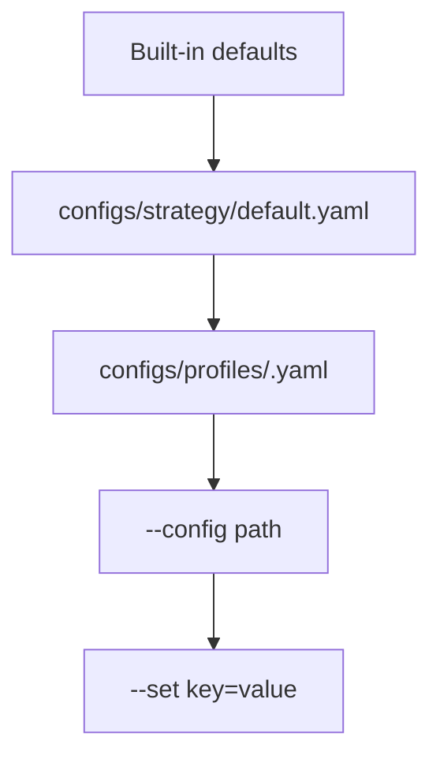

# Config Schema

Runtime config lives under:

- `configs/strategy/default.yaml`
- `configs/profiles/conservative.yaml`
- `configs/profiles/balanced.yaml`
- `configs/profiles/aggressive.yaml`

## Keys

```yaml
capital:
  initial_capital: float

risk:
  max_positions_per_sector: int
  daily_loss_halt_pct: float
  max_open_risk_pct_of_equity: float
  max_new_position_risk_pct_of_equity: float
  max_position_notional_pct: float

features:
  news_enabled: bool
  earnings_enabled: bool

execution:
  order_mode: str  # market | limit | stop_limit
  no_trade_first_minutes: int
  no_trade_last_minutes: int
  limit_offset_pct: float
  stop_offset_pct: float
```

## Precedence



## Examples

```bash
python live_trader.py --profile balanced --status
python live_trader.py --profile conservative --set risk.max_positions_per_sector=2 --loop
python live_trader.py --config configs/strategy/default.yaml --set features.news_enabled=false --status
```
