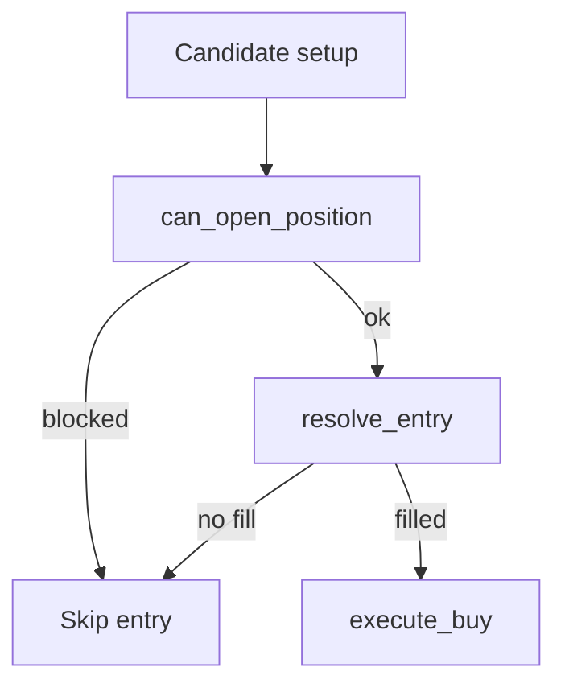

# Execution Engine (Sprint 2)

Execution realism is now applied in historical testing through `core/execution/execution_engine.py`.

## Supported Modes

- `market`: fills at current bar close
- `limit`: fills only if bar low reaches configured limit price
- `stop_limit`: requires trigger and limit fill conditions

## Trade Window Controls

- `no_trade_first_minutes`: block new entries after market open
- `no_trade_last_minutes`: block new entries before market close

## Data Flow

