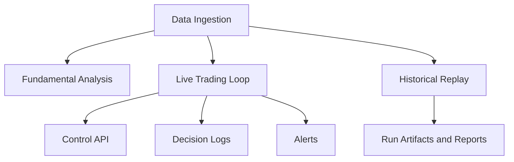

# Features and Functional Breakdown

## Core Capability Map

## Fundamental Analysis

Files:
- `downloader.py`
- `analyzer.py`
- `technical.py`

Function:
- fetch SEC filings
- extract financial and textual signals
- compute multi-method valuation
- generate HTML reports

## Live Trading Engine

Files:
- `live_trader.py`
- `portfolio.py`
- `indicators.py`

Function:
- market regime gating
- candidate scoring and filtering
- entry/exit execution
- baseline capital deployment
- equity and history tracking

## Config and Risk

Files:
- `configs/strategy/default.yaml`
- `configs/profiles/*.yaml`
- `core/strategy/config_loader.py`
- `core/risk/risk_engine_v2.py`

Function:
- profile-based runtime behavior
- CLI overrides via `--set key=value`
- portfolio-level risk gating

## Execution Realism

Files:
- `core/execution/execution_engine.py`

Function:
- market / limit / stop-limit entry modeling
- opening/closing intraday entry windows
- fill/no-fill simulation logic

## Historical Replay Lab

Files:
- `historical_tester/tester.py`
- `historical_tester/optimizer.py`
- `historical_tester/run_registry.py`

Function:
- accelerated simulation over historical windows
- parameter sweep, walk-forward, A/B compare
- reproducible run artifacts and leaderboard

## Control Center and Operator Controls

Files:
- `control_center/state_store.py`
- `control_center/api.py`
- `control_center/approvals.py`

Function:
- pause buys/sells
- emergency flatten
- manual approval queue for entries
- local HTTP API for operations

## Explainability and Alerts

Files:
- `core/explainability/decision_logger.py`
- `core/alerts/notifier.py`
- `core/alerts/rules.py`

Function:
- structured decision event logging
- alert routing to console/file/webhook
- event-level alert filtering rules
