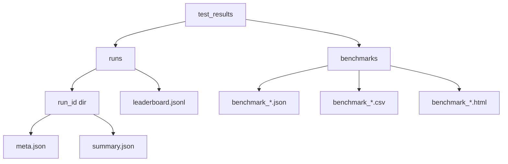

# Historical Lab

The historical lab is the fast validation surface for strategy changes. It now supports
engine adapters, benchmark reports, optimizer ranking, and validation contracts.

## Modes

- `single`: run one backtest on one engine
- `benchmark`: run multiple engines on the same window and write standardized report output
- `sweep`: objective-ranked override sweep via optimizer contract
- `interactive`: prompt-driven mode selector

## Engines

- `native`: existing internal replay path (baseline)
- `backtrader`: adapter PoC that integrates through the same engine interface

## Optimizer + Validation

- `historical_tester/optimizers/freqtrade_style.py`: objective ranking with constraints
- `historical_tester/validators/lean_adapter.py`: LEAN-style parity validator contract

## Commands

```bash
python -m historical_tester --mode single --engine native
python -m historical_tester --mode single --engine backtrader
python -m historical_tester --mode benchmark --engines native,backtrader
python -m historical_tester --mode benchmark --engines native,backtrader --validate-with lean
python -m historical_tester --mode sweep --engine native
```

## Artifacts


