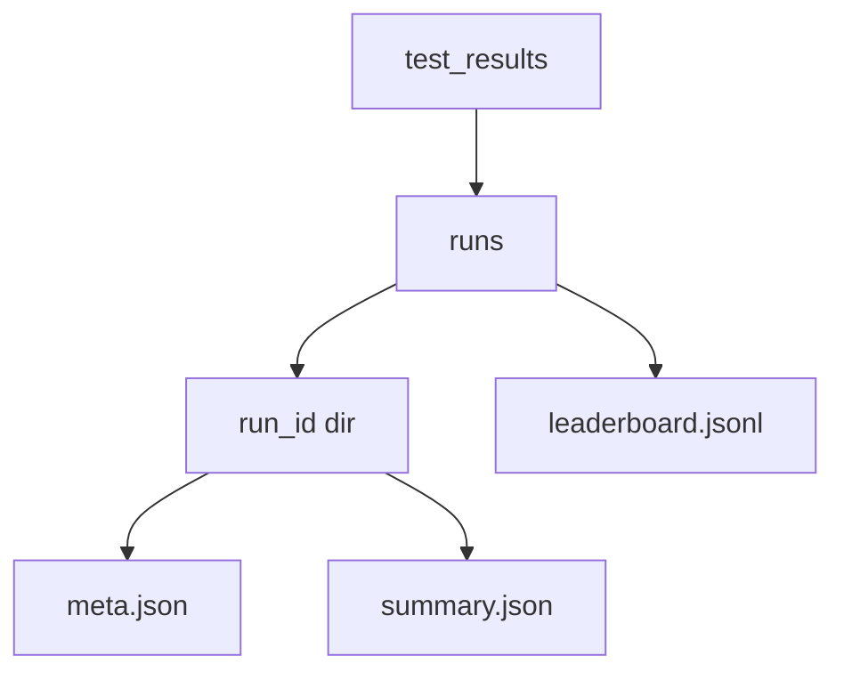

# Historical Lab

The historical tester now supports advanced experiment modes:

- `single`: one run over selected period
- `sweep`: parameter sweep over override sets
- `walk`: rolling walk-forward windows
- `compare`: A/B profile comparison

## Components

- `historical_tester/optimizer.py`
- `historical_tester/run_registry.py`
- `historical_tester/tester.py` (interactive mode selector)

## Run Artifact Layout

