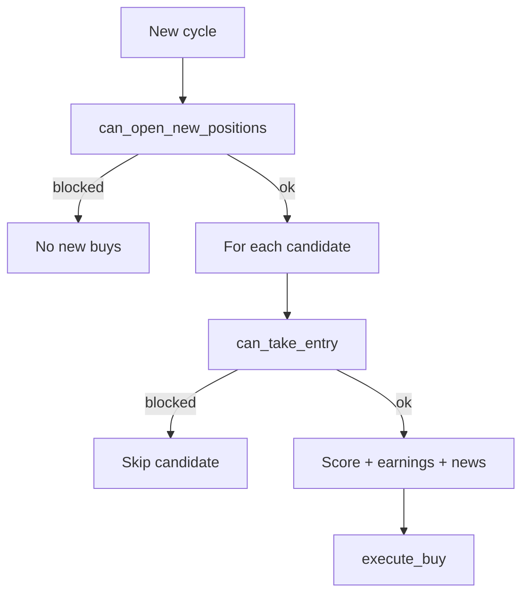

# Risk Engine v2

Risk Engine v2 adds portfolio-level controls before opening new positions.

## Current Gates

- Daily realized-loss halt
- Open-risk budget cap (sum of entry-to-stop risk across open positions)
- Sector concentration cap
- Estimated new-position risk cap

## Integration Points

- `live_trader.py`
  - `scan_and_buy()` checks portfolio gate before scanning entries
  - per-candidate entry gate checked before earnings/news/final buy call
- Config-driven values from `configs/*`

## Decision Flow

