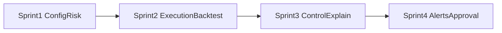

# Roadmap 1-7

This roadmap tracks the implementation sequence for feature sets 1 through 7.

## Sprint 1 (Implemented)

- Config layer with profiles and CLI overrides
- Risk Engine v2 portfolio and entry gates
- Integration into `live_trader.py`
- Integration into `historical_tester/tester.py`

## Sprint 2

- Execution realism (order modes and intraday trade windows) - implemented
- Historical lab upgrades (sweeps, walk-forward, A/B) - implemented

## Sprint 3

- Control center API/UI - implemented (API + runtime control state)
- Explainability and full decision audit trail - implemented (structured decision logs)

## Sprint 4

- Alerts and manual approval workflow - implemented
- Hardening and operational runbooks - implemented

## Delivery Flow

